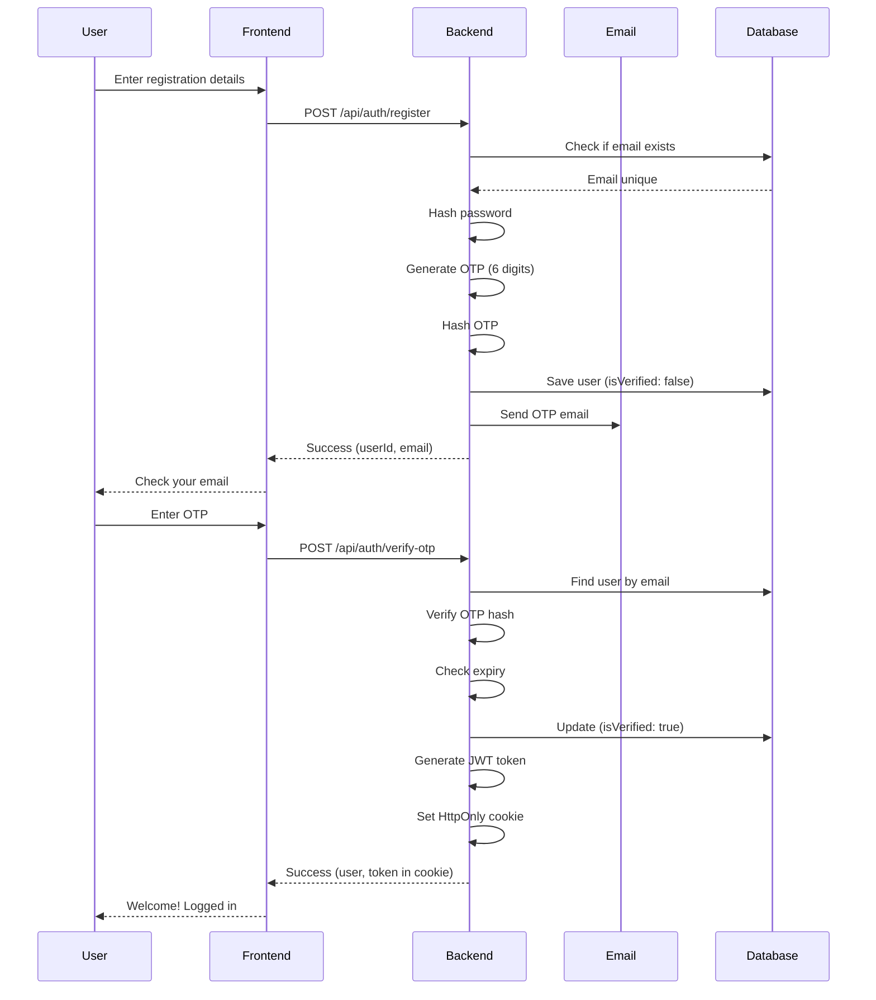
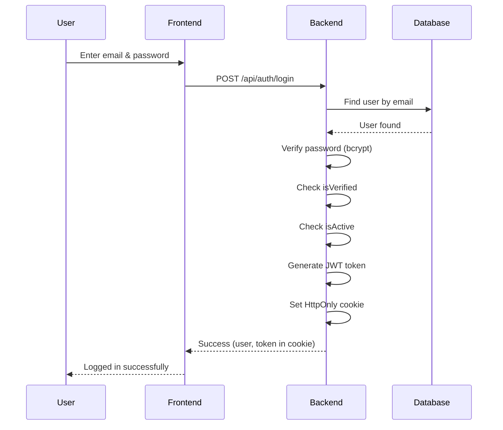

# 🔐 User Authentication API Documentation

Complete guide for the Civic Report System authentication endpoints.

---

## 📋 Table of Contents

1. [Overview](#overview)
2. [Authentication Flow](#authentication-flow)
3. [Environment Setup](#environment-setup)
4. [API Endpoints](#api-endpoints)
5. [Request/Response Examples](#request-response-examples)
6. [Error Handling](#error-handling)
7. [Security Features](#security-features)
8. [Testing Guide](#testing-guide)

---

## Overview

### Features

✅ **OTP-Based Email Verification**
- 6-digit OTP sent via email
- 10-minute expiry window
- Rate limited (3 OTPs per hour)
- Account lock after 5 failed attempts

✅ **JWT Token Authentication**
- Long-lived token (7 days)
- HttpOnly cookie storage
- Automatic token refresh
- Secure token validation

✅ **Security**
- Password hashing (bcrypt)
- OTP hashing in database
- Rate limiting on all auth routes
- Input validation & sanitization
- XSS protection

✅ **User Management**
- Email verification required
- Account activation status
- Role-based access (user/admin)
- Profile management

---

## Authentication Flow

### Registration & Verification Flow



### Login Flow



---

## Environment Setup

### Required Environment Variables

Add these to your `.env` file:

```env
# Server Configuration
PORT=5000
NODE_ENV=development
FRONTEND_URL=http://localhost:5173

# Database
MONGO_URI=mongodb://localhost:27017/civic-report

# JWT Configuration
JWT_SECRET=your_64_character_secret_key_here_minimum_32_characters
JWT_EXPIRE=7d

# Email Configuration (Gmail)
EMAIL_HOST=smtp.gmail.com
EMAIL_PORT=587
EMAIL_USER=your-email@gmail.com
EMAIL_PASSWORD=your-app-specific-password
EMAIL_FROM=Civic Report <noreply@civicreport.com>
EMAIL_TEST_MODE=true

# OTP Configuration
OTP_EXPIRY_MINUTES=10
```

### Generate JWT Secret

```bash
node -e "console.log(require('crypto').randomBytes(64).toString('hex'))"
```

### Gmail App Password Setup

1. Go to [Google Account Settings](https://myaccount.google.com/)
2. Security → 2-Step Verification (enable if not already)
3. Security → App Passwords
4. Generate new app password
5. Copy password to `EMAIL_PASSWORD` in `.env`

---

## API Endpoints

### Base URL
```
http://localhost:5000/api/auth
```

### Endpoints Summary

| Method | Endpoint | Description | Auth Required |
|--------|----------|-------------|---------------|
| POST | `/register` | Register new user | ❌ No |
| POST | `/verify-otp` | Verify OTP & activate account | ❌ No |
| GET | `/verify-otp/:email/:otp` | Verify OTP via URL | ❌ No |
| POST | `/resend-otp` | Resend verification OTP | ❌ No |
| POST | `/login` | Login user | ❌ No |
| GET | `/me` | Get current user profile | ✅ Yes |
| GET | `/logout` | Logout user | ❌ No |

---

## Request/Response Examples

### 1. Register User

**Endpoint:** `POST /api/auth/register`

**Request:**
```http
POST http://localhost:5000/api/auth/register
Content-Type: application/json

{
  "name": "John Doe",
  "email": "john.doe@example.com",
  "password": "SecurePass123"
}
```

**Validation Rules:**
- `name`: 2-100 characters (required)
- `email`: Valid email format (required)
- `password`: 8+ characters, must contain number and letter (required)

**Success Response (201):**
```json
{
  "success": true,
  "message": "Registration successful! Please check your email for OTP verification.",
  "data": {
    "userId": "68f76536b4a5978764e937c6",
    "email": "john.doe@example.com",
    "otpExpiresIn": 10
  }
}
```

**Error Response (400):**
```json
{
  "success": false,
  "message": "Email already registered. Please login."
}
```

**Error Response (400 - Not Verified):**
```json
{
  "success": false,
  "message": "Email already registered but not verified. Please verify your email or request a new OTP.",
  "code": "EMAIL_NOT_VERIFIED"
}
```

---

### 2. Verify OTP

**Endpoint:** `POST /api/auth/verify-otp`

**Request:**
```http
POST http://localhost:5000/api/auth/verify-otp
Content-Type: application/json

{
  "email": "john.doe@example.com",
  "otp": "123456"
}
```

**Validation Rules:**
- `email`: Valid email format (required)
- `otp`: Exactly 6 digits (required)

**Success Response (200):**
```json
{
  "success": true,
  "message": "Email verified successfully! You are now logged in.",
  "data": {
    "user": {
      "id": "68f76536b4a5978764e937c6",
      "name": "John Doe",
      "email": "john.doe@example.com",
      "role": "user",
      "isVerified": true
    }
  }
}
```

**Note:** JWT token is automatically set in HttpOnly cookie.

**Error Response (400 - Invalid OTP):**
```json
{
  "success": false,
  "message": "Invalid OTP. 4 attempts remaining."
}
```

**Error Response (400 - Expired OTP):**
```json
{
  "success": false,
  "message": "OTP has expired. Please request a new OTP.",
  "code": "OTP_EXPIRED"
}
```

**Error Response (429 - Account Locked):**
```json
{
  "success": false,
  "message": "Account temporarily locked due to too many failed attempts. Try again in 15 minutes."
}
```

---

### 3. Verify OTP via URL

**Endpoint:** `GET /api/auth/verify-otp/:email/:otp`

**Request:**
```http
GET http://localhost:5000/api/auth/verify-otp/john.doe%40example.com/123456
```

**Success Response:**
- Redirects to `FRONTEND_URL` with token set in cookie
- HTTP Status: 302 (Redirect)

**Note:** This endpoint is designed for email link verification. The frontend should handle the redirect and check for authentication.

---

### 4. Resend OTP

**Endpoint:** `POST /api/auth/resend-otp`

**Request:**
```http
POST http://localhost:5000/api/auth/resend-otp
Content-Type: application/json

{
  "email": "john.doe@example.com"
}
```

**Success Response (200):**
```json
{
  "success": true,
  "message": "New OTP sent to your email.",
  "data": {
    "email": "john.doe@example.com",
    "otpExpiresIn": 10
  }
}
```

**Error Response (429 - Rate Limited):**
```json
{
  "success": false,
  "message": "Too many OTP requests. Please try again in 45 minutes."
}
```

---

### 5. Login

**Endpoint:** `POST /api/auth/login`

**Request:**
```http
POST http://localhost:5000/api/auth/login
Content-Type: application/json

{
  "email": "john.doe@example.com",
  "password": "SecurePass123"
}
```

**Success Response (200):**
```json
{
  "success": true,
  "message": "Login successful",
  "data": {
    "user": {
      "id": "68f76536b4a5978764e937c6",
      "name": "John Doe",
      "email": "john.doe@example.com",
      "role": "user",
      "isVerified": true
    }
  }
}
```

**Note:** JWT token is automatically set in HttpOnly cookie.

**Error Response (401):**
```json
{
  "success": false,
  "message": "Invalid email or password."
}
```

**Error Response (403 - Not Verified):**
```json
{
  "success": false,
  "message": "Please verify your email before logging in.",
  "code": "EMAIL_NOT_VERIFIED"
}
```

**Error Response (403 - Deactivated):**
```json
{
  "success": false,
  "message": "Your account has been deactivated. Please contact support."
}
```

---

### 6. Get Current User

**Endpoint:** `GET /api/auth/me`

**Request:**
```http
GET http://localhost:5000/api/auth/me
Cookie: token=<jwt_token>
```

**Note:** Token is automatically sent via HttpOnly cookie. No manual header needed.

**Success Response (200):**
```json
{
  "success": true,
  "data": {
    "user": {
      "id": "68f76536b4a5978764e937c6",
      "name": "John Doe",
      "email": "john.doe@example.com",
      "role": "user",
      "isVerified": true,
      "hasSeenTour": false,
      "createdAt": "2025-01-15T10:30:00.000Z"
    }
  }
}
```

**Error Response (401):**
```json
{
  "success": false,
  "message": "Not authorized. No token provided."
}
```

---

### 7. Logout

**Endpoint:** `GET /api/auth/logout`

**Request:**
```http
GET http://localhost:5000/api/auth/logout
```

**Success Response (200):**
```json
{
  "success": true,
  "message": "Logged out successfully"
}
```

**Note:** Clears the HttpOnly cookie containing the JWT token.

---

## Error Handling

### Standard Error Response Format

```json
{
  "success": false,
  "message": "Error description",
  "errors": ["Specific error 1", "Specific error 2"]
}
```

### Common Error Codes

| Status Code | Description |
|-------------|-------------|
| 400 | Bad Request - Validation failed |
| 401 | Unauthorized - Invalid or missing token |
| 403 | Forbidden - Account not verified or deactivated |
| 404 | Not Found - User not found |
| 429 | Too Many Requests - Rate limit exceeded |
| 500 | Internal Server Error |

### Validation Errors

**Example:**
```json
{
  "success": false,
  "message": "Validation failed",
  "errors": [
    "Name is required",
    "Password must be at least 8 characters",
    "Password must contain at least one number"
  ]
}
```

---

## Security Features

### 1. Password


# 📋 Report Routes Setup Instructions

## ✅ Files Created

All report-related files have been created. Here's what was added:

### **New Files:**
1. `/config/cloudinary.js` - Cloudinary configuration
2. `/middleware/uploadMiddleware.js` - Multer + file upload handling
3. `/utils/mediaService.js` - Cloudinary upload/delete operations
4. `/utils/reportValidation.js` - Report data validation
5. `/controllers/reportController.js` - 5 report endpoints
6. `/routes/reportRoutes.js` - Report routes configuration

### **Updated Files:**
- `/server.js` - Added report routes and Cloudinary test

---

## 📦 Install Required Packages

```bash
npm install cloudinary multer
```

**Packages:**
- `cloudinary` - Cloud storage for images/videos/audio
- `multer` - Handle multipart/form-data file uploads

---

## 🔐 Environment Variables

Add these to your `.env` file:

```env
MONGO_URI=""
JWT_SECRET="someverylongandhardtoguesssecret"
PORT=5000
FRONTEND_URL='http://localhost:5000'
EMAIL_TEST_MODE= true  # Set to true unless you want to send real emails
OTP_EXPIRY_MINUTES=10
EMAIL_FROM="'Civic Report' <noreply@civicreport.com>"

# for sending real emails, configure these
EMAIL_USER=''
EMAIL_PASSWORD=''

JWT_EXPIRE='7d'

# Cloudinary Configuration
CLOUDINARY_CLOUD_NAME=''
CLOUDINARY_API_KEY=''
CLOUDINARY_API_SECRET=
CLOUDINARY_FOLDER=civic-reports

# File Upload Limits
MAX_IMAGE_SIZE=5242880    # 5MB in bytes
MAX_VIDEO_SIZE=52428800   # 50MB in bytes
MAX_AUDIO_SIZE=10485760   # 10MB in bytes
MAX_IMAGES_COUNT=5
MAX_VIDEOS_COUNT=1
MAX_AUDIO_COUNT=1
```

### **How to Get Cloudinary Credentials:**

1. Go to https://cloudinary.com/
2. Sign up for free account (no credit card required)
3. After login, go to **Dashboard**
4. Copy these values:
   - **Cloud Name** → `CLOUDINARY_CLOUD_NAME`
   - **API Key** → `CLOUDINARY_API_KEY`
   - **API Secret** → `CLOUDINARY_API_SECRET`

---

## 🚀 API Endpoints

### **1. Create Report**
```http
POST /api/reports/create
Authorization: Bearer <access_token>
Content-Type: multipart/form-data

Form Data:
- title: "Large pothole on Main Street"
- description: "Dangerous pothole causing vehicle damage"
- category: "public_works"
- severity: "high"
- location: {"coordinates": [77.2090, 28.6139], "name": "Main Street, Agra"}
- images: [file1.jpg, file2.jpg]
- videos: [video1.mp4]
- audio: [voice-note.m4a]
```

**Response:**
```json
{
  "success": true,
  "message": "Report created successfully",
  "data": {
    "report": {
      "_id": "65abc123...",
      "title": "Large pothole on Main Street",
      "status": "reported",
      "severity": "high",
      "media": [
        {
          "type": "image",
          "url": "https://res.cloudinary.com/...",
          "thumbnail": "https://res.cloudinary.com/..."
        }
      ],
      "upvotes": 0,
      "createdAt": "2025-01-15T10:30:00Z"
    }
  }
}
```

---

### **2. Get My Reports**
```http
GET /api/reports/my-reports?page=1&limit=20&status=reported&category=sanitation&sortBy=createdAt&order=desc
Authorization: Bearer <access_token>
```

**Query Parameters:**
- `page` - Page number (default: 1)
- `limit` - Items per page (default: 20)
- `status` - Filter by status (optional)
- `category` - Filter by category (optional)
- `sortBy` - Sort field (default: createdAt)
- `order` - asc/desc (default: desc)

**Response:**
```json
{
  "success": true,
  "data": {
    "reports": [...],
    "pagination": {
      "page": 1,
      "limit": 20,
      "total": 45,
      "pages": 3
    }
  }
}
```

---

### **3. Get Report by ID**
```http
GET /api/reports/65abc123...
Authorization: Bearer <access_token>
```

**Response:**
```json
{
  "success": true,
  "data": {
    "report": {
      "_id": "65abc123...",
      "title": "...",
      "description": "...",
      "user": {
        "name": "John Doe",
        "email": "john@example.com"
      },
      "history": [...],
      "media": [...]
    }
  }
}
```

---

### **4. Get Nearby Reports**
```http
GET /api/reports/nearby?lat=28.6139&lng=77.2090&radius=5000&limit=100
Authorization: Bearer <access_token>
```

**Query Parameters:**
- `lat` - Latitude (required)
- `lng` - Longitude (required)
- `radius` - Radius in meters (default: 5000, max: 50000)
- `limit` - Max results (default: 100, max: 100)
- `status` - Filter by status (optional)
- `category` - Filter by category (optional)

**Response:**
```json
{
  "success": true,
  "data": {
    "reports": [...],
    "query": {
      "center": { "lat": 28.6139, "lng": 77.2090 },
      "radius": 5000,
      "count": 15
    }
  }
}
```

---

### **5. Upvote Report (Toggle)**
```http
PATCH /api/reports/65abc123.../upvote
Authorization: Bearer <access_token>
```

**Response:**
```json
{
  "success": true,
  "message": "Report upvoted successfully",
  "data": {
    "reportId": "65abc123...",
    "upvotes": 6,
    "severity": "medium",
    "hasUpvoted": true,
    "severityUpgraded": true
  }
}
```

**Severity Auto-Upgrade Logic:**
- 0-4 upvotes: Original severity
- 5-9 upvotes: Upgrade 'low' → 'medium'
- 10-19 upvotes: Upgrade to 'high'
- 20+ upvotes: Upgrade to 'critical'

---

## 🧪 Testing with Postman/Thunder Client

### **Test 1: Create Report**

1. **Set Authorization:**
   - Type: Bearer Token
   - Token: Copy from login/verify-otp response

2. **Set Body:**
   - Type: form-data
   - Add fields:
     ```
     title: "Test Report"
     description: "This is a test report with detailed description"
     category: "sanitation"
     severity: "medium"
     location: {"coordinates": [77.2090, 28.6139], "name": "Test Location, Agra"}
     ```
   - Add files:
     ```
     images: [select 1-5 image files]
     videos: [select 1 video file]
     audio: [select 1 audio file]
     ```

3. **Send Request**

---

### **Test 2: Get My Reports**

```http
GET http://localhost:5000/api/reports/my-reports
Authorization: Bearer <token>
```

---

### **Test 3: Upvote Report**

```http
PATCH http://localhost:5000/api/reports/<reportId>/upvote
Authorization: Bearer <token>
```

Send twice to test toggle (upvote → un-upvote)

---

## ⚠️ File Upload Limits

| Type | Max Size | Max Count | Allowed Formats |
|------|----------|-----------|-----------------|
| Images | 5MB each | 5 files | jpg, jpeg, png, webp |
| Videos | 50MB each | 1 file | mp4, mov, avi |
| Audio | 10MB each | 1 file | mp3, wav, m4a |

---

## 🔍 Validation Rules

### **Create Report:**
- ✅ Title: 5-100 characters (required)
- ✅ Description: 10-500 characters (required)
- ✅ Category: Must be valid enum value (required)
- ✅ Severity: low/medium/high/critical (required)
- ✅ Location coordinates: Valid [lng, lat] (required)
- ✅ Location name: 3-200 characters (required)
- ✅ At least 1 media file (required)

### **Nearby Reports:**
- ✅ lat: -90 to 90 (required)
- ✅ lng: -180 to 180 (required)
- ✅ radius: 100-50000 meters (default: 5000)
- ✅ limit: 1-100 (default: 100)

---

## 🛠️ Troubleshooting

### **Error: "Cloudinary configuration missing"**
- Make sure `.env` has all Cloudinary variables
- Restart server after adding env variables

### **Error: "File too large"**
- Check file size limits in `.env`
- Images: Max 5MB each
- Videos: Max 50MB each
- Audio: Max 10MB each

### **Error: "Invalid file type"**
- Only allowed formats work
- Images: jpg, jpeg, png, webp
- Videos: mp4, mov, avi
- Audio: mp3, wav, m4a

### **Error: "At least one media file required"**
- You must upload at least 1 file (image/video/audio)

### **Error: "Location coordinates are required"**
- Location must be JSON format: `{"coordinates": [lng, lat], "name": "Location Name"}`
- In Postman form-data, make sure location value is valid JSON string

---

## 📊 Cloudinary Features

Your uploaded files will have:

✅ **Images:**
- Original image uploaded
- 200x200 thumbnail auto-generated
- Optimized format (auto WebP when supported)

✅ **Videos:**
- Transcoded to MP4 format
- Video thumbnail auto-generated
- Optimized quality

✅ **Audio:**
- Converted to MP3 format
- Compressed for web delivery

---

## 🎯 Next Steps

You now have a complete report system with:
- ✅ Media upload to Cloudinary
- ✅ File validation & size limits
- ✅ Geospatial queries (nearby reports)
- ✅ Upvote system with severity auto-upgrade
- ✅ Pagination & filtering
- ✅ Full error handling

**Need to add:**
- Admin routes (update status, assign departments)
- Report editing/deletion
- Comments system
- Notifications

Let me know when you're ready for the next feature! 🚀